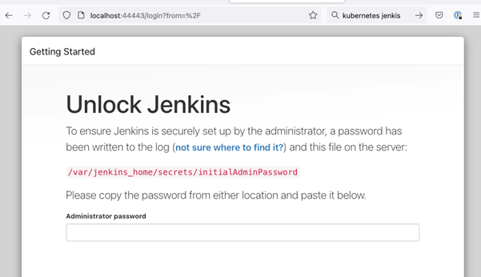

# Setup
```bash
sudo apt install docker.io
docker --version
sudo systemctl enable docker
curl -s https://packages.cloud.google.com/apt/doc/apt-key.gpg | sudo apt-key add
sudo apt install curl
sudo apt-get update
sudo apt install curl
sudo apt-add-repository "deb http://apt.kubernetes.io/ kubernetes-xenial main"
sudo apt install kubeadm
kubeadm version
sudo swapoff -a
sudo hostnamectl set-hostname master
sudo vi /etc/hostname
sudo reboot
```
```bash
sudo kubeadm init --pod-network-cidr=10.244.0.0/16

# Error in the previous command:
#
# Unfortunately, an error has occurred:
# 	timed out waiting for the condition
#
# This error is likely caused by:
# 	- The kubelet is not running
# 	- The kubelet is unhealthy due to a misconfiguration of the node in some way (required cgroups disabled)
#
# If you are on a systemd-powered system, you can try to troubleshoot the error with the following commands:
# 	- 'systemctl status kubelet'
# 	- 'journalctl -xeu kubelet'
#
# Fix

sudo systemctl start kubelet
sudo systemctl status kubelet
kubeadm reset

# and try again
sudo kubeadm init --pod-network-cidr=10.244.0.0/16
```
To start using your cluster, you need to run the following as a regular user:
```bash
mkdir -p $HOME/.kube
sudo cp -i /etc/kubernetes/admin.conf $HOME/.kube/config
sudo chown $(id -u):$(id -g) $HOME/.kube/config
```
Deploy a POD Network
```bash
sudo kubectl apply -f https://raw.githubusercontent.com/coreos/flannel/master/Documentation/kube-flannel.yml
```
Installation Checks
```bash
root@master:/etc# kubectl get pods -A
NAMESPACE     NAME                             READY   STATUS    RESTARTS   AGE
kube-system   coredns-6d4b75cb6d-gfwnb         1/1     Running   0          2m40s
kube-system   coredns-6d4b75cb6d-rnmfv         1/1     Running   0          2m40s
kube-system   etcd-master                      1/1     Running   1          2m56s
kube-system   kube-apiserver-master            1/1     Running   1          2m56s
kube-system   kube-controller-manager-master   1/1     Running   1          2m56s
kube-system   kube-flannel-ds-bdjn2            1/1     Running   0          21s
kube-system   kube-proxy-r8hz8                 1/1     Running   0          2m40s
kube-system   kube-scheduler-master            1/1     Running   1          2m56s

root@master:/etc# kubectl get nodes
NAME     STATUS   ROLES           AGE     VERSION
master   Ready    control-plane   3m30s   v1.24.1
```
Allow schedule PODs in Master
```bash
kubectl taint node master node-role.kubernetes.io/control-plane:NoSchedule-
```

# Jenkins
root/yaml/jenkins.yaml
```yaml
apiVersion: v1
kind: Service
metadata:
  name: jenkins
spec:
  type: ClusterIP
  ports:
  - name: http
    port: 8080
    targetPort: 8080
    protocol: TCP
  selector:
    app: jenkins
---
apiVersion: apps/v1
kind: Deployment
metadata:
  name: jenkins
spec:
  replicas: 1
  selector:
    matchLabels:
      app: jenkins
  template:
    metadata:
      labels:
        app: jenkins
    spec:
      containers:
      - name: jenkins
        image: jenkins/jenkins:lts
        ports:
          - name: http
            containerPort: 8080
        env:
        - name: JENKINS_OPTS
          value: --prefix=/jenkins
        volumeMounts:
          - name: jenkins-vol
            mountPath: /var/jenkins_vol
      volumes:
        - name: jenkins-vol
          emptyDir: {}
```
Deploy Jenkins
```bash
kubectl apply -f jenkins.yaml
```
```bash
root@master:~/yamls# kubectl get pods
NAME                       READY   STATUS              RESTARTS   AGE
jenkins-5bf8d67f6c-4dqv2   1/1     Running             0          110s

root@master:~/yamls# kubectl get svc
NAME           TYPE        CLUSTER-IP     EXTERNAL-IP   PORT(S)          AGE
jenkins        NodePort    10.110.64.92   <none>        8080:30360/TCP   18m
jenkins-jnlp   ClusterIP   10.98.23.11    <none>        50000/TCP        18m
kubernetes     ClusterIP   10.96.0.1      <none>        443/TCP          19h
```

## Remote port forwarding
Use the Nodeport port exposed in the host
```ssh_conf
Host nitak8
  User root
  Hostname 10.51.135.206
  Port 22
  IdentityFile ~/.ssh/id_rsa
  ProxyCommand ssh -W %h:%p ttsv-shell101
  LocalForward 44443 10.51.135.206:30360
```
```bash
kubectl logs jenkins-5bf8d67f6c-4dqv2


*************************************************************
*************************************************************
*************************************************************

Jenkins initial setup is required. An admin user has been created and a password generated.
Please use the following password to proceed to installation:

57a7002a64b044998d359546f6b9c693

This may also be found at: /var/jenkins_home/secrets/initialAdminPassword

*************************************************************
```
Add the password via console



# Webapp
Note: *the following script is not working for K8 as the way to communicate between pods is different than in docker*
```
./build-and-test-webapp/wait-for-db.sh
```
root/yamls/webapp.yaml
```yaml
apiVersion: v1
kind: Service
metadata:
  name: webapp
spec:
  type: ClusterIP
  ports:
  - name: http
    port: 8000
    targetPort: 8000
    protocol: TCP
  selector:
    app: webapp
---
apiVersion: v1
kind: PersistentVolumeClaim
metadata:
  name: webapp-pv-claim
  labels:
    app: webapp
spec:
  accessModes:
    - ReadWriteOnce
  resources:
    requests:
      storage: 5Gi
---
apiVersion: v1
kind: PersistentVolume
metadata:
  name: webapp-pv-volume
  labels:
    app: webapp
    type: local
spec:
  capacity:
    storage: 5Gi
  accessModes:
    - ReadWriteOnce
  hostPath:
    path: "/tmp"
---
apiVersion: apps/v1
kind: Deployment
metadata:
  name: webapp
spec:
  replicas: 1
  selector:
    matchLabels:
      app: webapp
  template:
    metadata:
      labels:
        app: webapp
    spec:
      containers:
      - name: webapp
        image: juniper/nita-webapp:21.7-1
        command: ["/bin/sh"]
        args: ["-c", "./build-and-test-webapp/wait-for-db.sh"]
        env:
          - name: DJANGO_LOG_LEVEL
            value: DEBUG
          - name: JENKINS_PASS
          - name: JENKINS_PORT
          - name: JENKINS_URL
          - name: JENKINS_USER
          - name: WEBAPP_PASS
          - name: WEBAPP_USER
          - name: WORDPRESS_DB_HOST
            value: wordpress-mysql
          - name: WORDPRESS_DB_PASSWORD
            valueFrom:
               secretKeyRef:
                 name: mysql-pass
                 key: password
        ports:
        - name: http
          containerPort: 8000
        volumeMounts:
        - name: webapp-persistent-storage
          mountPath: /var/www/html
      volumes:
      - name: webapp-persistent-storage
        persistentVolumeClaim:
          claimName: webapp-pv-claim
```

# Maria
root/yamls/mariadb.yaml
```yaml
apiVersion: v1
kind: Service
metadata:
  name: mariadb
spec:
  type: ClusterIP
  ports:
  - name: db-port
    port: 3306
    targetPort: 3306
    protocol: TCP
  selector:
    app: mariadb
---
apiVersion: v1
kind: PersistentVolumeClaim
metadata:
  name: mysql-pv-claim
  labels:
    app: mariadb
spec:
  accessModes:
    - ReadWriteOnce
  resources:
    requests:
      storage: 5Gi
---
apiVersion: v1
kind: PersistentVolume
metadata:
  name: mysql-pv-volume
  labels:
    app: mariadb
    type: local
spec:
  capacity:
    storage: 5Gi
  accessModes:
    - ReadWriteOnce
  hostPath:
    path: "/tmp"
---
apiVersion: v1
kind: Secret
metadata:
  name: mysql-pass
type: Opaque
data:
  rootpassword: cm9vdA==
  username: cm9vdA==
  password: cm9vdA==
---
apiVersion: apps/v1
kind: Deployment
metadata:
  name: mariadb
spec:
  replicas: 1
  selector:
    matchLabels:
      app: mariadb
  template:
    metadata:
      labels:
        app: mariadb
    spec:
      containers:
      - image: mariadb:10.4.12
        name: mariadb
        env:
        - name: MYSQL_ROOT_PASSWORD
          valueFrom:
            secretKeyRef:
              name: mysql-pass
              key: password
        ports:
        - containerPort: 3306
          name: mysql
        volumeMounts:
        - name: mysql-persistent-storage
          mountPath: /var/lib/mysql
      volumes:
      - name: mysql-persistent-storage
        persistentVolumeClaim:
          claimName: mysql-pv-claim
```

# Robot
root/yamls/robot.yaml
```yaml
apiVersion: v1
kind: Service
metadata:
  name: robot
spec:
  type: ClusterIP
  ports:
  - name: http
    port: 8080
    targetPort: 8080
    protocol: TCP
  selector:
    app: robot
---
apiVersion: apps/v1
kind: Deployment
metadata:
  name: robot
spec:
  replicas: 1
  selector:
    matchLabels:
      app: robot
  template:
    metadata:
      labels:
        app: robot
    spec:
      containers:
      - name: robot
        image: juniper/nita-robot:21.7-1
        ports:
          - name: http
            containerPort: 8080
        volumeMounts:
          - name: robot-vol
            mountPath: /var/robot_vol
      volumes:
        - name: robot-vol
          emptyDir: {}
```

# Ansible
TODO

# Ingress
When I try access the Webapp using the browser I see nginx forwarding traffic to webapp correctly but Webapp container is not listening as it should. The web service is not well configured
```
Nginx event
GET /webapp/ HTTP/1.1" 502 150 "-" "Mozilla/5.0 (Macintosh; Intel Mac OS X 10.15; rv:101.0) Gecko/20100101 Firefox/101.0" 667 0.001 [default-webapp-8000] [] 10.244.0.27:8000, 10.244.0.27:8000, 10.244.0.27:8000 0, 0, 0 0.000, 0.000, 0.000 502, 502, 502 065205c3ab074cab564e29aa7684f6f6
```
root/yamls/ingress.yaml
```yaml
apiVersion: networking.k8s.io/v1
kind: Ingress
metadata:
  name: minimal-ingress
  annotations:
    #nginx.ingress.kubernetes.io/proxy-body-size: 20m
    #nginx.ingress.kubernetes.io/rewrite-target: /
    #kubernetes.io/ingress.allow-http: "true"
spec:
  ingressClassName: nginx
  rules:
  - http:
      paths:
      - path: /jenkins
        pathType: Prefix
        backend:
          service:
            name: jenkins
            port:
              number: 8080
            paths:
      - path: /webapp
        pathType: Prefix
        backend:
          service:
            name: webapp
            port:
              number: 8000
```

# Nginx
[https://github.com/kubernetes/ingress-nginx/blob/main/deploy/static/provider/baremetal/deploy.yaml](https://github.com/kubernetes/ingress-nginx/blob/main/deploy/static/provider/baremetal/deploy.yaml)

## From dockercompose to K8 (Kompose)
The result didn’t have sense, anyway here are the steps. You will find the out put in the nita-compose folder
```bash
curl -L https://github.com/kubernetes/kompose/releases/download/v1.26.0/kompose-linux-amd64 -o kompose
chmod +x kompose
sudo mv ./kompose /usr/local/bin/compose

mkdir nita-compose
cd nita-compose/
vi docker-compose.yaml
kompose convert
```
